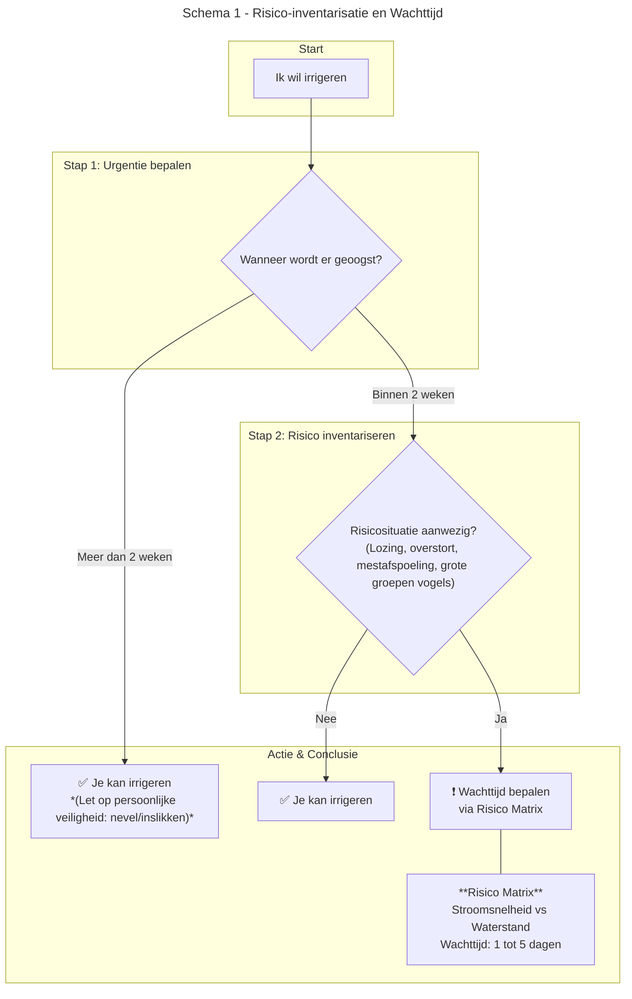
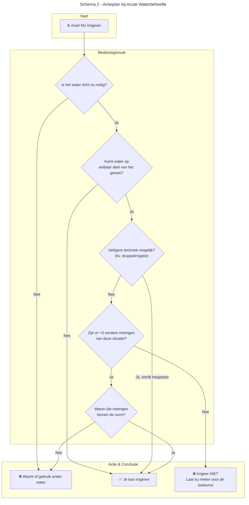

```mermaid
---
title: Schema 1 - Risico-inventarisatie en Wachttijd
---
graph TD
    subgraph Start
        A[Ik wil irrigeren]
    end
    subgraph X ["<div style="width:35em; height:2em; display:flex; justify-content: flex-start; align-items:flex-end;">Stap 1: Urgentie bepalen</div>"]
        D1{"Wanneer wordt er geoogst?"}
    end

    subgraph Y ["<div style="width:28em; height:2em; display:flex; justify-content: flex-start; align-items:flex-end;">Stap 2: Risico inventariseren</div>"]
        D2{"Risicosituatie aanwezig?<br/>(Lozing, overstort, mestafspoeling, grote groepen vogels)"}
    end

    subgraph "Actie & Conclusie"
        E["✅ Je kan irrigeren<br/>*(Let op persoonlijke veiligheid: nevel/inslikken)*"]
        F[✅ Je kan irrigeren]
        G[❗ Wachttijd bepalen<br/>via Risico Matrix]
        G_note["**Risico Matrix**<br/>Stroomsnelheid vs Waterstand<br/>Wachttijd: 1 tot 5 dagen"]
    end

    A --> D1
    D1 -- "Meer dan 2 weken" --> E
    D1 -- "Binnen 2 weken" --> D2
    
    D2 -- "Nee" --> F
    D2 -- "Ja" --> G
    
    G --- G_note
```

```mermaid
---
title: Schema 2 - Actieplan bij Acute Waterbehoefte
---
graph TD
    subgraph Start
        S1[Ik moet NU irrigeren]
    end

    subgraph Beslissingsroute
        D1{"Is het water écht nu nodig?"}
        D2{"Komt water op<br/>eetbaar deel van het gewas?"}
        D3{"Veiligere techniek mogelijk?<br/>(bv. druppelirrigatie)"}
        D4{"Zijn er >3 eerdere metingen<br/>van deze situatie?"}
        D5{"Waren die metingen<br/>binnen de norm?"}
    end

    subgraph "Actie & Conclusie"
        A1[❌ Wacht of gebruik ander water]
        A2[✅ Je kan irrigeren]
        A3[❌ Irrigeer NIET<br/><i>Laat nu meten voor de toekomst</i>]
    end
    
    S1 --> D1
    D1 -- "Nee" --> A1
    D1 -- "Ja" --> D2
    
    D2 -- "Nee" --> A2
    D2 -- "Ja" --> D3
    
    D3 -- "Ja, wordt toegepast" --> A2
    D3 -- "Nee" --> D4
    
    D4 -- "Nee" --> A3
    D4 -- "Ja" --> D5
    
    D5 -- "Ja" --> A2
    D5 -- "Nee" --> A1

    %% Styling
```
