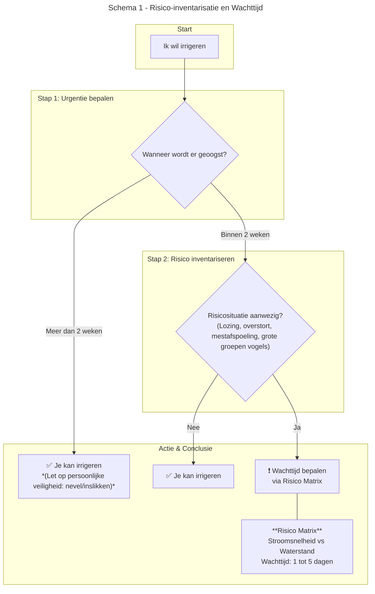
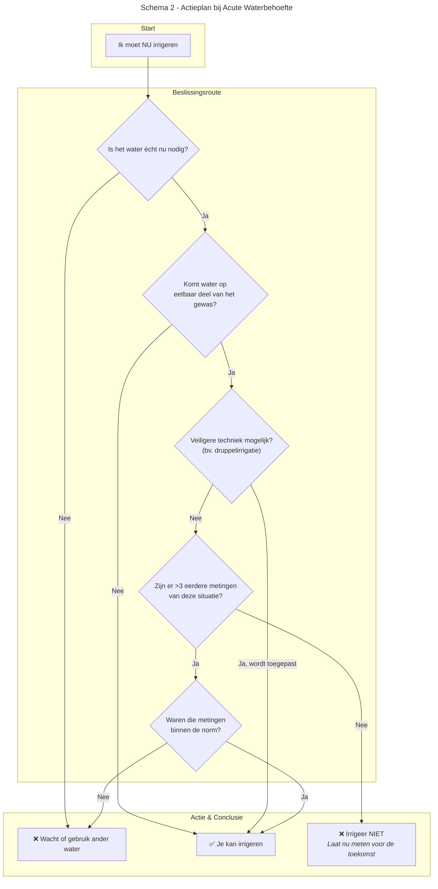

# Project FoodS: Handvaten voor Veilig Irrigatiewater

Dit project biedt praktische handvaten en beslissingsondersteunende hulpmiddelen voor agrariërs om veilig gebruik te maken van oppervlaktewater voor irrigatie, in lijn met de geest van de GlobalGAP-regelgeving.

## Omschrijving

Het doel van GlobalGAP is het waarborgen van de voedselveiligheid, onder andere door het testen van oppervlaktewater dat wordt gebruikt voor irrigatie. Dit project laat zien hoe agrariërs en consumenten beter beschermd kunnen worden aan de hand van simpele vuistregels, zonder dat dit veel extra moeite kost. De focus ligt op de risico's voor de menselijke gezondheid.

## Achtergrond

De GlobalGAP-wetgeving vereist doorgaans enkele metingen van het oppervlaktewater per jaar. Echter, de waterkwaliteit kan op de schaal van dagen of zelfs uren fluctueren, waardoor deze metingen alleen niet altijd een volledig beeld geven.

Dit project overbrugt die kloof door redelijke inschattingen van de waterkwaliteit mogelijk te maken, zelfs zonder directe meting. De hier gepresenteerde vuistregels zijn gebaseerd op een combinatie van modellen, risico-inschattingen, praktijkervaring en gezond boerenverstand. Metingen blijven echter een essentieel middel om onbekende situaties te evalueren.

## Doelgroep

Dit document is primair bedoeld als rugsteun voor agrariërs die te maken hebben met de GlobalGAP-regelgeving voor irrigatiewater.

## Inhoud van deze Repository

* **/word/WaterSafety_SHP_g.docx**: Het volledige brondocument met gedetailleerde uitleg over risico's, de logica achter de stroomschema's, factsheets over ziekteverwekkers en structurele ("no-regret") maatregelen.
* **/pdf/poster.pdf**: Informatieve poster die de kernboodschappen en stroomschema's samenvat voor gebruik in de praktijk.
* `README.md`: Dit bestand.

## Kern van de Aanpak: De Stroomschema's

De kern van dit project wordt gevormd door twee stroomschema's die helpen bij het nemen van een concrete actie.

### 1. Schema 1: Risico-inventarisatie en Wachttijd
Dit schema is voor geplande irrigatie en helpt te bepalen of er een risico is en hoe lang men eventueel moet wachten.

### 2. Schema 2: Actieplan bij Acute Waterbehoefte
Dit schema is voor situaties waarin wachten volgens Schema 1 eigenlijk niet mogelijk is door bijvoorbeeld extreme droogte[cite: 87]. 

## Technische Details: Mermaid Flowcharts

De flowcharts in deze repository zijn geschreven in [Mermaid syntax](https://mermaid-js.github.io/mermaid/#/). Dit is een op tekst gebaseerde manier om diagrammen te genereren.

* **Bekijken**: GitHub rendert `.md` bestanden met Mermaid-blokken automatisch als visuele diagrammen.
* **Bewerken**: U kunt de `.md` bestanden direct in een teksteditor aanpassen. Om de wijzigingen live te zien, kunt u de [Mermaid Live Editor](https://mermaid.live) gebruiken.

