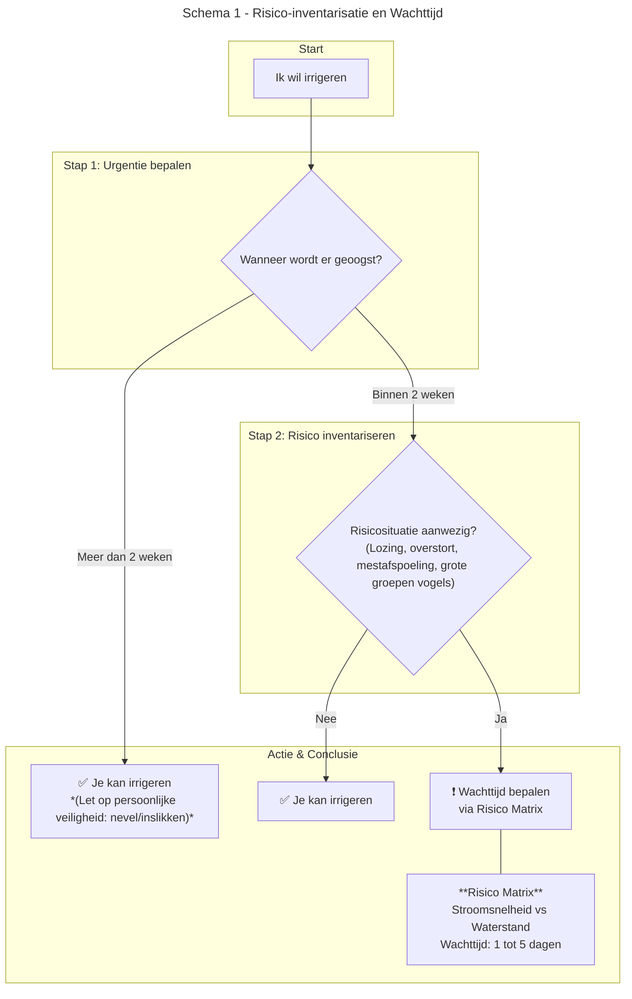
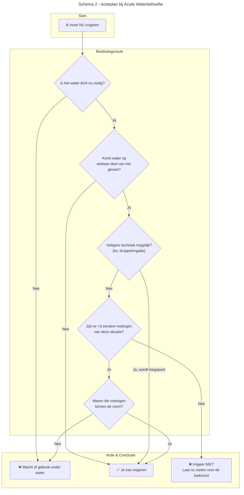

## 3\. Actieplan: Werken met de Stroomschema's

\[HIER DE AFBEELDING VAN DE STROOMSCHEMA'S INVOEGEN\]

De hierboven geplaatste stroomschema's vormen de kern van deze handleiding. Ze helpen u om van een situatie naar een concrete actie te gaan. Hieronder wordt de logica van de schema's stap voor stap uitgelegd.

**3.1 Stroomschema 1: Risico-inventarisatie en Wachttijd**

Dit schema helpt u te bepalen of er een risico is en hoe lang u moet wachten voordat u veilig kunt irrigeren.

**Stap 1: Bepaal de urgentie op basis van de oogst**. De eerste vraag die u zichzelf stelt is: **"Wanneer wordt er geoogst?"**

- **Oogst over meer dan 2 weken:** De natuurlijke afsterving van ziekteverwekkers door zonlicht (UV) en uitdroging op het gewas is aanzienlijk. Er is daarom **geen verplichte wachttijd** voor de waterinname. Let wel op de veiligheid van uzelf en uw personeel: vermijd dat de nevel wordt ingeademd of dat water wordt ingeslikt.
- **Oogst binnen 2 weken:** Het risico op overleving van pathogenen op het gewas is reëel. Ga door naar de volgende stap in de risico-inventarisatie.

**Stap 2: Inventariseer de risico's.** Is er sprake van een van de volgende recente situaties stroomopwaarts van uw inlaatpunt?

1. Een (mogelijke) lozing
2. Een riool overstort
3. Zichtbare afspoeling van mest (van landbouw- of weidedieren)
4. Grote zwermen vogels die langdurig in of rond het water verblijven

- **NEE:** Als geen van deze situaties van toepassing is, kunt u veilig irrigeren.
- **JA:** Er is een verhoogd risico. Ga naar Stap 3.

**Stap 3: Bepaal de wachttijd met deze risico tabel.** Als er een risico is, wordt de wachttijd bepaald door de combinatie van **stroomsnelheid** en **waterstand**. Deze factoren bepalen hoe snel de vervuiling wordt afgevoerd en verdund. Gebruik de volgende matrix:

|     | **Waterstand: Laag** (weinig verdunning) | **Waterstand: Hoog** (veel verdunning) |
| --- | --- | --- |
| **Stroomsnelheid: Laag** (weinig afvoer) | **5 dagen** | **3-4 dagen** |
| **Stroomsnelheid: Hoog** (veel afvoer) | **2 dagen** | **1 dag** |

**Toelichting:** Bij een lage stroomsnelheid en lage waterstand is er weinig verdunning en wegspoeling, dus is de wachttijd het langst. Bij een hoge stroomsnelheid en hoge waterstand is de vervuiling het snelst verdwenen.

_Let op: Bij een continue, structurele vervuiling (zoals een constant lekkende leiding) begint de wachttijd pas te tellen vanaf het moment dat de vervuiling is gestopt._

**3.2 Stroomschema 2: Actieplan bij Acute Waterbehoefte**

Dit schema gebruikt u als u volgens Schema 1 zou moeten wachten, maar u toch dringend water nodig heeft (bv. door extreme hitte en droogte).

**Stap 1: Heroverweeg de noodzaak**. De eerste en belangrijkste vraag: "Is het water **echt nu** nodig?". Soms is een dag wachten of het gebruik van een alternatieve bron (indien beschikbaar) de veiligste en makkelijkste oplossing.

**Stap 2: Evalueer het contact met het gewas.** "Komt het irrigatiewater in direct contact met het **eetbare deel** van het gewas?"

- **NEE:** Bij gewassen waar het oogstbare product onder de grond groeit (bv. aardappelen, wortelen) of waar het water de vruchten niet raakt, kunt u irrigeren.
- **JA:** Ga naar Stap 3.

**Stap 3: Pas de irrigatietechniek aan.** "Kunt u een veiligere irrigatietechniek toepassen?"

- De voorkeursmethode is **druppelirrigatie**. Dit brengt water direct bij de wortels en houdt het eetbare gewas schoon en droog. Dit verlaagt het risico drastisch.
- NEE: Ga naar Stap 4.

**Stap 4: Gebruik historische meetgegevens**. Als een veiligere techniek geen optie is, kunt u terugvallen op uw eigen meetgegevens: "Zijn er **meer dan 3 metingen** van een vergelijkbare risicosituatie beschikbaar?"

- **JA:** Waren de waarden van die metingen **binnen de norm** (< 1000 kve/100 ml)? Dan kunt u met een aanvaardbaar risico toch irrigeren. Zo niet, dan is het risico te hoog.
- **NEE:** U heeft onvoldoende data om het risico te weerleggen. De aanbevolen actie is dan: **niet irrigeren met dit water**. Maak van de gelegenheid gebruik en laat de concentratie nu meten. Zo bouwt u data op en weet u voor de toekomst of u in deze omstandigheden wel of niet veilig kunt handelen.
