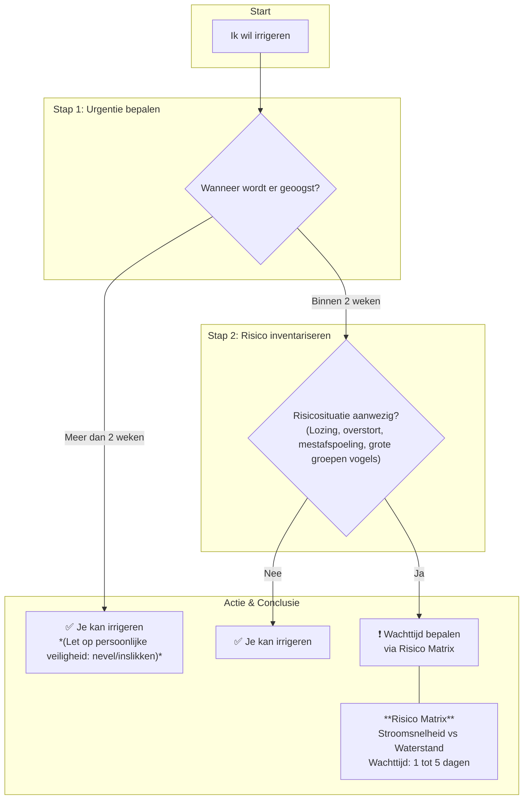
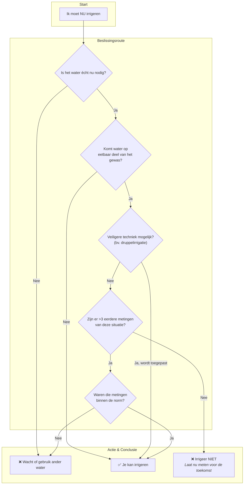

# Abstract

GlobalGAP heeft als doel het veiligstellen van onze gezondheid door het herhaald testen van oppervlaktewater dat gebruikt wordt voor irrigatie van gewassen. Let wel, dit document gaat over mensgezondheid en niet over diergezondheid. In dit document laten we zien dat aan de hand van een aantal simpele vuistregels de gezondheid van agrariër en consument beter beschermd kan worden zonder dat dit veel extra moeite kost.

---

# Visuele samenvatting

Voor een snel overzicht kun je de poster hieronder bekijken of direct downloaden voor later gebruik.

<iframe src="poster.pdf" width="100%" height="800px" title="Poster FoodS Veilig Irrigatiewater">
    
Je browser ondersteunt geen ingesloten PDF's. Gebruik de knop hierboven om de poster te downloaden.

</iframe>

---

# Introductie

Oppervlaktewater gebruiken voor irrigatie is gebonden aan wet- en regelgeving om de (microbiële) kwaliteit van dit water te garanderen en zo onze gezondheid veilig te stellen. Zoals vaak bij regels en wetgeving blijkt het moeilijk de balans te vinden tussen effectiviteit en hoeveel tijd en moeite de uitvoering ervan is. Weinig mensen zullen staan trappelen bij de gedachte iedere dag de kwaliteit van het irrigatiewater te moeten meten. Anderzijds garandeer je met weinig meten de kwaliteit ook niet. Op dit moment vereist de GlobalGAP-wetgeving ongeveer twee metingen van het oppervlaktewater per jaar, afhankelijk van het type gewas. Echter, schommelingen in waterkwaliteit vinden plaats op de schaal van dagen en uren, en worden met slechts twee metingen niet gedekt.

Ook zonder meting kunnen redelijke inschattingen gemaakt worden van de waterkwaliteit; deze hebben we in dit document opgeschreven als vuistregels. Dit is op basis van kennis verkregen door het gebruik van modellen, risico-inschattingen, ervaringen en gezond boerenverstand. Metingen blijven echter een essentieel middel om een onbekende situatie of verwachting te evalueren.

In dit document geven we deze vuistregels en hoe ze in de praktijk te brengen. Om dit tot zijn recht te laten komen is het belangrijk duidelijk te hebben waar deze vuistregels tegen beschermen. Waterkwaliteit, vervuiling, besmetting: het gaat over iets wat je niet kan zien, maar grote gevolgen kan hebben voor jouw gezondheid, je gewassen en de gezondheid van de consument. De bedreiging wordt gevormd door microscopische boosdoeners die via de uitwerpselen, urine en lichamen van mens en dier in het water terechtkomen. Het is dus essentieel te weten wanneer oppervlaktewater vervuild wordt en, nog belangrijker, hoe of wanneer het water weer veilig voor gebruik is.

---

## Belangrijke Begrippen (Lexicon)

Om het document goed te begrijpen, lichten we hier de belangrijkste termen toe.

- **Oppervlaktewater.** Oppervlaktewater is al het water dat in contact staat met de buitenlucht. Dit behelst rivieren, meren, beken, sloten, maar ook waterbassins, zelfs al hebben deze een ondergrondse bron. Vrijwel alle bronnen van irrigatiewater zijn hierdoor oppervlaktewater.
- **Indicatororganisme (E. coli).** GlobalGAP maakt gebruik van de bacterie _Escherichia coli_ (_E. coli_) als een indicatororganisme. Dit wil zeggen dat de aanwezigheid van deze bacterie informatie verschaft over de waterkwaliteit. _E. coli_ is een darmbacterie van mensen en warmbloedige dieren en kan buiten het lichaam niet lang overleven. De aanwezigheid van _E. coli_ in oppervlaktewater duidt dus op een recente vervuiling met mest. Omdat mest ook ziekteverwekkers kan bevatten, is de hoeveelheid _E. coli_ een maat voor het gezondheidsrisico. Het is veel eenvoudiger en goedkoper om op één indicator te testen dan op alle mogelijke ziekteverwekkers.
- **GlobalGAP** De regelgevende entiteit, als je het GlobalGAP-certificaat wilt gebruiken. Zij stellen de eis dat de microbiologische kwaliteit van irrigatiewater een aantal keer per jaar (afhankelijk van het gewas) gemeten wordt. De norm is dat de hoeveelheid _E. coli_ lager moet zijn dan 1000 kolonievormende eenheden (kve) per 100 ml water.

---

## De Risico's: Wanneer is water een gevaar?

De gezondheidsrisico’s komen vrijwel altijd door verontreiniging met mest, urine of kadavers van mens en dier. De hoofdoorzaken zijn: 1. Fikse regenbuien, 2. Lozingen en lekkages, en 3. Dieren in het gebied.

---

### Risico’s optredend bij regen

- **Riooloverstort:** Bij hevige regen kan het riool de hoeveelheid water niet aan en stort het een mengsel van regen- en rioolwater in het oppervlaktewater. Dit veroorzaakt een plotselinge, zeer hoge piek van ziekteverwekkers. \[Hier een schematische tekening van een stad/dorp met een rioolpijp die tijdens een regenbui uitstroomt in een nabijgelegen rivier of kanaal, met stroomafwaarts een irrigatiepomp.\]
- **Mestafspoeling van het land:** Na het uitrijden van mest kan een zware regenbui de mest van het land de sloot in spoelen. Verse mest vormt een groter risico dan oude, ingedroogde mest. \[Hier een schematische tekening van een bemest weiland dat afhelt naar een sloot, met pijlen die de afspoeling tijdens een regenbui visualiseren.\]

---

### Risico's door lozingen en lekkages

- **Lekkage mestopslag:** Een lekkende mestsilo of mestvaalt kan continu of plotseling mest en ziekteverwekkers in het nabijgelegen water laten sijpelen.
- **Rioolwaterzuivering (RWZI):** Een RWZI loost gezuiverd rioolwater. Hoewel het gezuiverd is, bevat het effluent altijd een restconcentratie ziekteverwekkers. De impact hangt af van de verdunning in het ontvangende water.
- **Septic Tanks / IBA's:** Een slecht onderhouden of overbelaste septic tank kan ongezuiverd afvalwater lekken, wat leidt tot een structurele, lokale verontreiniging.
- **Andere lozingen:** Denk aan illegale lozingen van campings, scheepvaart of slachterijen. Deze zijn onvoorspelbaar maar kunnen zeer hoge concentraties ziekteverwekkers bevatten.

---

### Risico’s door dieren

- **Wilde dieren (vogels, ratten, etc.):** Grote groepen watervogels of een aanzienlijke rattenpopulatie bij uw waterinlaatpunt zorgen voor een constante aanvoer van uitwerpselen en dus een verhoogd risico.
- **Dode dieren:** Een dood dier (vogel, rat, schaap) in het water is een bron van bacteriën, met name _Clostridium botulinum_ (veroorzaker van botulisme).

---

### Samenvattende Risicotabel

| Situatie | Factoren die risico verhogen | Indicatieve wachttijd na piek | Aanbevolen actie |
| --- | --- | --- | --- |
| Hevige neerslag | Zware bui na lange droge periode. | 2-3 dagen | Wacht tot het water weer helder is. |
| Riooloverstort | Inlaatpunt dichtbij en stroomafwaarts van de overstort; weinig stroming. | 5-7 dagen | Vermijd waterinname. |
| Mestafspoeling | Verse mest, recent uitgereden, zware regenbui, klei/leemgrond. | 3-5 dagen | Wacht en inspecteer het water visueel. |
| Lekkage mestopslag | Opslag direct naast de waterbron, zichtbare lekkage. | Permanent risico | Verplaats opslag (>25m van water) of los lek op. |
| RWZI / Septic Tank | Inlaatpunt dichtbij en stroomafwaarts van de lozing. | Permanent risico | Verplaats inlaatpunt verder weg. Bij twijfel: meten. |
| Veel (water)vogels | Grote groep (>20) vogels verblijft langdurig bij inlaatpunt. | 2-3 dagen na vertrek | Verjaag de vogels. Vermijd waterinname op die locatie. |
| Dode dieren | Kadaver in of nabij het water. | 2-3 dagen na verwijdering | Direct melden en (laten) verwijderen. |

---

## Actieplan: Werken met de Stroomschema's

\[HIER DE AFBEELDING VAN DE STROOMSCHEMA'S INVOEGEN\]

De hierboven geplaatste stroomschema's vormen de kern van deze handleiding. Ze helpen u om van een situatie naar een concrete actie te gaan. Hieronder wordt de logica van de schema's stap voor stap uitgelegd.

**3.1 Stroomschema 1: Risico-inventarisatie en Wachttijd**

Dit schema helpt u te bepalen of er een risico is en hoe lang u moet wachten voordat u veilig kunt irrigeren.

**Stap 1: Bepaal de urgentie op basis van de oogst**. De eerste vraag die u zichzelf stelt is: **"Wanneer wordt er geoogst?"**

- **Oogst over meer dan 2 weken:** De natuurlijke afsterving van ziekteverwekkers door zonlicht (UV) en uitdroging op het gewas is aanzienlijk. Er is daarom **geen verplichte wachttijd** voor de waterinname. Let wel op de veiligheid van uzelf en uw personeel: vermijd dat de nevel wordt ingeademd of dat water wordt ingeslikt.
- **Oogst binnen 2 weken:** Het risico op overleving van pathogenen op het gewas is reëel. Ga door naar de volgende stap in de risico-inventarisatie.

**Stap 2: Inventariseer de risico's.** Is er sprake van een van de volgende recente situaties stroomopwaarts van uw inlaatpunt?

1. Een (mogelijke) lozing
2. Een riool overstort
3. Zichtbare afspoeling van mest (van landbouw- of weidedieren)
4. Grote zwermen vogels die langdurig in of rond het water verblijven

- **NEE:** Als geen van deze situaties van toepassing is, kunt u veilig irrigeren.
- **JA:** Er is een verhoogd risico. Ga naar Stap 3.

**Stap 3: Bepaal de wachttijd met deze risico tabel.** Als er een risico is, wordt de wachttijd bepaald door de combinatie van **stroomsnelheid** en **waterstand**. Deze factoren bepalen hoe snel de vervuiling wordt afgevoerd en verdund. Gebruik de volgende matrix:

|     | **Waterstand: Laag** (weinig verdunning) | **Waterstand: Hoog** (veel verdunning) |
| --- | --- | --- |
| **Stroomsnelheid: Laag** (weinig afvoer) | **5 dagen** | **3-4 dagen** |
| **Stroomsnelheid: Hoog** (veel afvoer) | **2 dagen** | **1 dag** |

**Toelichting:** Bij een lage stroomsnelheid en lage waterstand is er weinig verdunning en wegspoeling, dus is de wachttijd het langst. Bij een hoge stroomsnelheid en hoge waterstand is de vervuiling het snelst verdwenen.

_Let op: Bij een continue, structurele vervuiling (zoals een constant lekkende leiding) begint de wachttijd pas te tellen vanaf het moment dat de vervuiling is gestopt._

**3.2 Stroomschema 2: Actieplan bij Acute Waterbehoefte**

Dit schema gebruikt u als u volgens Schema 1 zou moeten wachten, maar u toch dringend water nodig heeft (bv. door extreme hitte en droogte).

**Stap 1: Heroverweeg de noodzaak**. De eerste en belangrijkste vraag: "Is het water **echt nu** nodig?". Soms is een dag wachten of het gebruik van een alternatieve bron (indien beschikbaar) de veiligste en makkelijkste oplossing.

**Stap 2: Evalueer het contact met het gewas.** "Komt het irrigatiewater in direct contact met het **eetbare deel** van het gewas?"

- **NEE:** Bij gewassen waar het oogstbare product onder de grond groeit (bv. aardappelen, wortelen) of waar het water de vruchten niet raakt, kunt u irrigeren.
- **JA:** Ga naar Stap 3.

**Stap 3: Pas de irrigatietechniek aan.** "Kunt u een veiligere irrigatietechniek toepassen?"

- De voorkeursmethode is **druppelirrigatie**. Dit brengt water direct bij de wortels en houdt het eetbare gewas schoon en droog. Dit verlaagt het risico drastisch.
- NEE: Ga naar Stap 4.

**Stap 4: Gebruik historische meetgegevens**. Als een veiligere techniek geen optie is, kunt u terugvallen op uw eigen meetgegevens: "Zijn er **meer dan 3 metingen** van een vergelijkbare risicosituatie beschikbaar?"

- **JA:** Waren de waarden van die metingen **binnen de norm** (< 1000 kve/100 ml)? Dan kunt u met een aanvaardbaar risico toch irrigeren. Zo niet, dan is het risico te hoog.
- **NEE:** U heeft onvoldoende data om het risico te weerleggen. De aanbevolen actie is dan: **niet irrigeren met dit water**. Maak van de gelegenheid gebruik en laat de concentratie nu meten. Zo bouwt u data op en weet u voor de toekomst of u in deze omstandigheden wel of niet veilig kunt handelen.

---

## Factsheets: De Boosdoeners

**Legionella – _Legionellose_**

- **Wat is het?** Een bacterie die van nature in water voorkomt en groeit in stilstaand water tussen 25°C en 45°C, bijvoorbeeld in leidingen en slangen die in de zon liggen.
- **Hoe word je ziek?** Door het inademen van kleine waterdruppeltjes (aerosolen) die de bacterie bevatten, zoals bij verneveling. Veroorzaakt griepachtige klachten of een ernstige longontsteking (veteranenziekte).
- **Preventie en actie:** Vermijd irrigatie door verneveling als het water lang heeft stilgestaan in leidingen bij warm weer. Gebruik bij voorkeur druppelirrigatie. Spoel leidingen voor gebruik door.

**Leptospira – _Ziekte van Weil_**

- **Wat is het?** Een bacterie die wordt verspreid via de urine van geïnfecteerde dieren, met name ratten. Overleeft goed in water en modder.
- **Hoe word je ziek?** Via contact van besmet water met wondjes, ogen of mond. Veroorzaakt griepachtige symptomen die kunnen leiden tot ernstige nier- en leverproblemen.
- **Preventie en actie:** Bestrijd ratten en muizen rondom waterbronnen. Wees voorzichtig met open wondjes bij contact met oppervlaktewater.

**Clostridium botulinum – _Botulisme_**

- **Wat is het?** Een bacterie die een zeer krachtig zenuwgif produceert. De bacterie groeit in zuurstofarme omstandigheden, zoals in rottende kadavers van (water)vogels.
- **Hoe word je ziek?** Door opname van de gifstof (niet de bacterie zelf). Bij mensen zeldzaam, maar kan verlamming van ademhalingsspieren veroorzaken.
- **Preventie en actie:** Verwijder dode dieren direct uit en rond het water. Er geldt een **meldplicht** voor dode vogels bij het waterschap of de NVWA, omdat dit kan wijzen op een uitbraak.

**Algemene ziekteverwekkers – _Diarree en buikgriep_**

- **Wat zijn het?** Een grote groep darmbacteriën (_E. coli_, _Campylobacter_), virussen (_Norovirus_) en parasieten (_Giardia_).
- **Hoe word je ziek?** Via opname van besmet water of het eten van met dit water besmette, ongewassen producten. Veroorzaken voornamelijk maag- en darmklachten.
- **Preventie en actie:** Volg de adviezen uit de stroomdiagrammen om besmetting van het irrigatiewater te voorkomen. Was producten voor consumptie.

---

## No-Regret Maatregelen: Slimme keuzes

Dit zijn maatregelen die de risico's structureel verlagen en vaak ook andere voordelen hebben. De kosten zijn relatief laag en de winst is hoog.

- **Gebruik druppelirrigatie:** Dit is de veiligste methode. Het water komt direct bij de wortels, waardoor het gewas zelf schoon blijft en er geen verneveling plaatsvindt. Bijkomend voordeel is een veel efficiënter watergebruik.
- **Kies een strategisch inlaatpunt:** Plaats uw waterinlaat permanent op een locatie die zo min mogelijk risico loopt: ver stroomopwaarts van lozingspunten en niet in stilstaande, ondiepe hoeken waar dieren zich graag ophouden.
- **Leg een bufferstrook aan:** Een strook met gras of andere vegetatie (minimaal enkele meters breed) langs uw waterbron kan afspoeling van mest en bestrijdingsmiddelen vanaf uw perceel aanzienlijk verminderen.
- **Gebruik een waterbassin:** Door water eerst op te pompen in een bassin en het daar enige tijd te laten staan, kunnen ziekteverwekkers bezinken en worden ze afgebroken door UV-licht van de zon. Dit fungeert als een extra veiligheidsbuffer.

---

## Over Meten: Weten is meten

Metingen blijven essentieel om zekerheid te krijgen in een onbekende of verdachte situatie.

- **Wat is een meting?** Een watermonster wordt naar een laboratorium gestuurd, waar men het aantal kolonievormende eenheden (kve) van _E. coli_ telt. Het resultaat geeft aan of het water op het moment van meten voldeed aan de GlobalGAP-norm.
- **De 3x regel:** Als u een terugkerende risicosituatie heeft (bv. irrigeren 3 dagen na een zware bui), meet dan ten minste **drie keer** onder die specifieke, vergelijkbare omstandigheden. Als de uitslag drie keer goed is, kunt u er met meer vertrouwen van uitgaan dat irrigatie onder die condities veilig is.

---