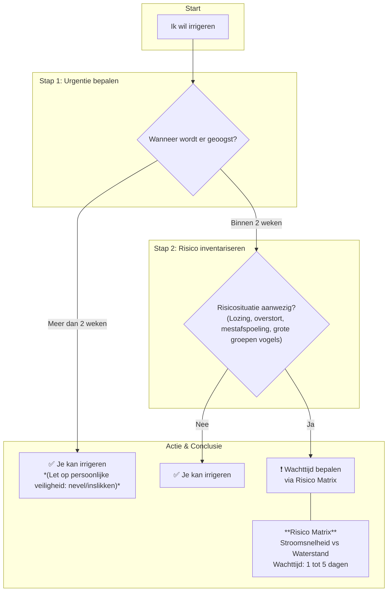
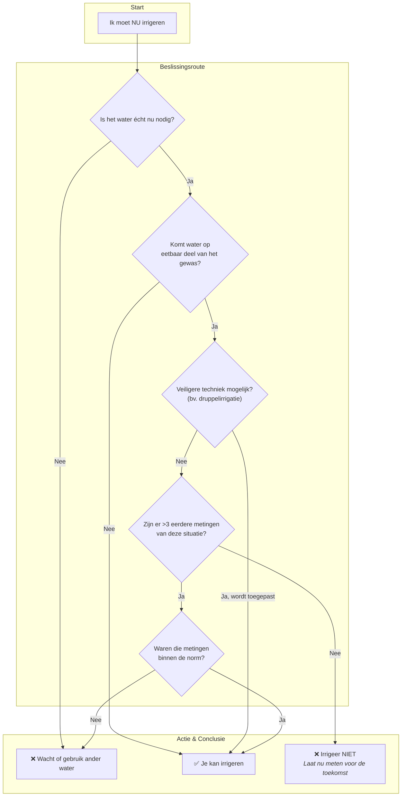

## De risico's van het gebruik van oppervlaktewater als irrigatiewater.

Welkom bij dit document over de risico's van het gebruik van oppervlaktewater als irrigatiewater. Dit document is bedoeld als een praktische gids en naslagwerk, en focust specifiek op de risico's en beheersmaatregelen. Het biedt telers, verwerkers en andere belanghebbenden in de agrifoodsector concrete handvatten om de voedselveiligheid te waarborgen. De inhoud is een samenvatting van expert opinions, getoetst en aangescherpt met experts uit de sector.

---

## Visuele samenvatting

Voor een snel overzicht kun je de poster hieronder bekijken of direct downloaden voor later gebruik.

<iframe src="poster.pdf" width="100%" height="800px" title="Poster FoodS Veilig Irrigatiewater">
    
Je browser ondersteunt geen ingesloten PDF's. Gebruik de knop hierboven om de poster te downloaden.

</iframe>

---

## Introductie

Oppervlaktewater gebruiken voor irrigatie is gebonden aan regelgeving om te zorgen dat consumenten via groenten en fruit niet besmet worden met humane pathogenen. De algemene beginselen zijn vastgelegd in de kaderverordening (EG) Nr. 178/2002, die het "voorzorgsbeginsel" introduceert. Dit betekent dat maatregelen genomen mogen worden om risico's te voorkomen, zelfs als er nog wetenschappelijke onzekerheid is.

Naast de Europese wetgeving zijn er private certificeringssystemen zoals GLOBALG.A.P. die ook eisen stellen. Nieuw sinds 2024 (versie 6) is dat telers elk jaar een verplichte risicoanalyse ('major must') moeten uitvoeren om vast te stellen of het irrigatiewater vervuild kan zijn door omgevingsfactoren zoals lozingen, overstorten of vee.

De beste manier om besmettingsrisico's te beheersen is door de waterkwaliteit te meten voor elk irrigatiemoment, maar dit is niet kosteneffectief. GLOBALG.A.P. vereist minimaal één meting per seizoen. Echter, de waterkwaliteit kan binnen uren of dagen sterk schommelen. Daarom is het essentieel om metingen te combineren met goed observeren en doordachte vuistregels. Dit document biedt die vuistregels, gebaseerd op modellen, praktijkervaring en gezond boerenverstand. Metingen blijven echter cruciaal om te voldoen aan de eisen en om onbekende situaties te beoordelen. Voedselveiligheid blijft altijd de verantwoordelijkheid van de ondernemer.

---

## Belangrijke Begrippen (Lexicon)

Om het document goed te begrijpen, lichten we hier de belangrijkste termen toe.

- **Oppervlaktewater.** Al het water dat in contact staat met de buitenlucht: rivieren, meren, beken en sloten, maar ook waterbassins.
- **Indicatororganisme (E. coli).** Voor het meten van microbiële waterkwaliteit wordt *Escherichia coli* (*E. coli*) internationaal gebruikt als indicatororganisme. *E. coli* is een darmbacterie van mensen en warmbloedige dieren en overleeft buiten het lichaam niet lang. De aanwezigheid ervan duidt dus op een recente vervuiling met mest. Omdat mest ook ziekteverwekkers kan bevatten, is de hoeveelheid *E. coli* een maat voor het gezondheidsrisico. Een *E. coli*-telling is een geaccepteerde manier om fecale besmetting te meten, maar de overlevingskarakteristieken zijn niet identiek aan die van alle andere humane pathogenen (zoals virussen en parasieten).
- **GLOBALG.A.P.** Een internationaal erkende certificeringsstandaard. Voor irrigatiewater stellen zij de eis dat de hoeveelheid *E. coli* lager moet zijn dan 1000 kolonievormende eenheden (kve) per 100 ml water. Daarnaast is een risicoanalyse verplicht, waarbij de teler moet aantonen welke beheersmaatregelen zijn genomen om besmetting te minimaliseren.

---

## De Gevaren: Wanneer kan water een bron van besmetting zijn?

Microbiële verontreiniging van oppervlaktewater komt vrijwel altijd door contact met mest, urine of kadavers van mens en dier. Dit is een potentieel gevaar. Het risico ontstaat pas als dit gevaar leidt tot een gevolg voor de mens. De hoofdoorzaken (gevaren) zijn: 1. Fikse regenbuien, 2. Lozingen en lekkages, en 3. Dieren in het gebied.

### Risico’s optredend bij regen

- **Riooloverstort:** Bij hevige regen kan het riool de hoeveelheid water niet aan en stort het een mengsel van regen- en rioolwater in het oppervlaktewater. Dit veroorzaakt een plotselinge, zeer hoge piek van ziekteverwekkers.
- **Mestafspoeling van het land:** Na het uitrijden van mest kan een zware regenbui de mest van het land de sloot in spoelen. Verse mest vormt een groter risico dan oude, ingedroogde mest.

### Risico's door lozingen en lekkages

- **Lekkage mestopslag:** Een lekkende mestsilo of mestvaalt kan continu of plotseling mest en ziekteverwekkers in het nabijgelegen water laten sijpelen.
- **Rioolwaterzuivering (RWZI):** Een RWZI loost gezuiverd rioolwater. Hoewel het gezuiverd is, bevat het effluent altijd een restconcentratie ziekteverwekkers.
- **Septic Tanks / IBA's:** Een slecht onderhouden of overbelaste septic tank kan ongezuiverd afvalwater lekken, wat leidt tot een structurele, lokale verontreiniging.
- **Andere lozingen:** Denk aan illegale lozingen van campings, scheepvaart of slachterijen.

### Risico’s door dieren

- **Wilde dieren (vogels, ratten, etc.):** Grote groepen watervogels of een aanzienlijke rattenpopulatie bij uw waterinlaatpunt zorgen voor een constante aanvoer van uitwerpselen.
- **Dode dieren:** Een dood dier (vogel, rat, schaap) in het water is een bron van bacteriën, met name *Clostridium botulinum* (veroorzaker van botulisme).

---

### Samenvattende Gevarentabel

| Situatie | Factoren die risico verhogen | Indicatieve wachttijd na piek | Aanbevolen actie |
| --- | --- | --- | --- |
| Hevige neerslag | Zware bui (> 3 mm/uur) na lange droge periode. | 2-3 dagen | Wacht tot het water weer helder is. |
| Riooloverstort | Inlaatpunt dichtbij en stroomafwaarts van de overstort; weinig stroming. | 5-7 dagen | Vermijd waterinname. |
| Mestafspoeling | Verse mest, recent uitgereden, zware regenbui, klei/leemgrond. | 3-5 dagen | Wacht en inspecteer het water visueel (let op troebelheid, kleur, algenbloei). |
| Lekkage mestopslag | Opslag direct naast de waterbron, zichtbare lekkage. | Permanent risico | Verplaats opslag (>25m van water) of los lek op. |
| RWZI / Septic Tank | Inlaatpunt dichtbij en stroomafwaarts van de lozing. | Permanent risico | Verplaats inlaatpunt verder weg. Bij twijfel: meten. |
| Veel (water)vogels | Grote groep (>20) vogels verblijft langdurig bij inlaatpunt. | 2-3 dagen na vertrek | Maak de locatie onaantrekkelijk voor langdurig verblijf. Vermijd waterinname. |
| Dode dieren | Kadaver in of nabij het water. | 2-3 dagen na verwijdering | Direct melden en (laten) verwijderen. |

---

## Actieplan: Werken met de Stroomschema's

De stroomschema's hieronder helpen u om van een situatie naar een concrete actie te gaan. Houd er rekening mee dat microben langer kunnen overleven in de donkere, vochtige delen van een gewas (zoals de oksels van prei, sla en andijvie). Fruit dat kort voor de oogst wordt besproeid, vormt ook een bijzondere categorie.

**Stroomschema 1: Risico-inventarisatie en Wachttijd**

Dit schema helpt u te bepalen of er een risico is en hoe lang u moet wachten voordat u veilig kunt irrigeren.

**Stap 1: Bepaal de urgentie.** Wanneer wordt er geoogst?

- **Oogst over meer dan 2 weken:** De natuurlijke afsterving van ziekteverwekkers door zonlicht (UV) en uitdroging is aanzienlijk. Er is geen verplichte wachttijd. Let wel op de veiligheid van uzelf en uw personeel.
- **Oogst binnen 2 weken:** Het risico op overleving van pathogenen op het gewas is reëel. Ga door naar stap 2.

**Stap 2: Inventariseer de risico's.** Is er recent een lozing, riooloverstort, mestafspoeling of een grote groep vogels stroomopwaarts van uw inlaatpunt?

- **NEE:** U kunt veilig irrigeren.
- **JA:** Er is een verhoogd risico. Ga naar Stap 3.

**Stap 3: Bepaal de wachttijd.** Deze wordt bepaald door de combinatie van **stroomsnelheid** en **waterstand**.

|     | **Waterstand: Laag** (weinig verdunning) | **Waterstand: Hoog** (veel verdunning) |
| --- | --- | --- |
| **Stroomsnelheid: Laag** (weinig afvoer) | **5 dagen** | **3-4 dagen** |
| **Stroomsnelheid: Hoog** (veel afvoer) | **2 dagen** | **1 dag** |

**Toelichting:** Bij een lage stroomsnelheid en lage waterstand duurt het het langst voordat de vervuiling is afgevoerd en verdund. _Let op: Bij een continue vervuiling begint de wachttijd pas als de bron is gestopt._

**Stroomschema 2: Actieplan bij Acute Waterbehoefte**

Dit schema gebruikt u als u volgens Schema 1 zou moeten wachten, maar u dringend water nodig heeft.

**Stap 1: Heroverweeg de noodzaak.** Is een dag wachten of een alternatieve bron een optie?

**Stap 2: Evalueer het contact met het gewas.** Komt het water in direct contact met het **eetbare deel**? Bij gewassen als aardappelen en wortelen is het risico kleiner.

**Stap 3: Pas de irrigatietechniek aan.** De voorkeursmethode is **druppelirrigatie**. Dit minimaliseert contact met het eetbare gewas en verlaagt het risico drastisch.

**Stap 4: Gebruik historische meetgegevens.** Als een veiligere techniek geen optie is, kunt u terugvallen op uw eigen data: "Zijn er **meer dan 3 metingen** van een vergelijkbare risicosituatie beschikbaar?" Deze '3x regel' is een praktische richtlijn om een risicodossier op te bouwen.

- **JA:** Waren de metingen **binnen de norm** (< 1000 kve/100 ml)? Dan kunt u met een aanvaardbaar risico irrigeren.
- **NEE:** U heeft onvoldoende data. De aanbevolen actie is: **niet irrigeren**. Laat de concentratie nu meten om data op te bouwen voor de toekomst.

---

## Factsheets: De Boosdoeners

**Legionella – _Legionellose_**
- **Wat is het?** Een bacterie die groeit in stilstaand water tussen 25°C en 45°C (bv. in leidingen in de zon).
- **Hoe word je ziek?** Door het inademen van kleine waterdruppeltjes (aerosolen). Veroorzaakt griep of longontsteking.
- **Preventie:** Vermijd verneveling met water dat lang heeft stilgestaan. Spoel leidingen door.

**Leptospira – _Ziekte van Weil_**
- **Wat is het?** Een bacterie verspreid via de urine van geïnfecteerde dieren, met name ratten.
- **Hoe word je ziek?** Via contact van besmet water met wondjes, ogen of mond.
- **Preventie:** Bestrijd ratten en muizen. Wees voorzichtig met open wondjes.

**Clostridium botulinum – _Botulisme_**
- **Wat is het?** Een bacterie die een krachtig zenuwgif produceert in zuurstofarme omstandigheden (bv. kadavers).
- **Hoe word je ziek?** Door opname van de gifstof.
- **Preventie:** Verwijder dode dieren direct. Er geldt een **meldplicht** bij het waterschap of de NVWA.

**Algemene ziekteverwekkers – _Diarree en buikgriep_**
- **Wat zijn het?** Een grote groep darmbacteriën (*Salmonella*, *E. coli*, *Campylobacter*), virussen (*Norovirus*) en parasieten (*Giardia*).
- **Hoe word je ziek?** Via opname van besmet water of besmette, ongewassen producten.
- **Preventie:** Volg de adviezen uit de stroomdiagrammen. Was producten voor consumptie.

---

## No-Regret Maatregelen: Slimme keuzes

Dit zijn maatregelen die risico's structureel verlagen en vaak ook andere voordelen hebben.

- **Gebruik druppelirrigatie:** De veiligste methode, die ook water bespaart.
- **Kies een strategisch inlaatpunt:** Plaats uw waterinlaat ver stroomopwaarts van lozingspunten en niet in stilstaande hoeken.
- **Leg een bufferstrook aan:** Een strook met vegetatie langs de waterkant vermindert afspoeling van het land.
- **Gebruik een waterbassin:** Water oppompen en laten staan geeft UV-licht de kans om ziekteverwekkers af te breken en dient als extra veiligheidsbuffer.

---

## Over Meten: Weten is meten

Metingen blijven essentieel om zekerheid te krijgen in een onbekende of verdachte situatie.

- **Wat is een meting?** Een watermonster wordt in een lab geanalyseerd op de hoeveelheid kve *E. coli*. Het resultaat toont of het water op dat moment aan de norm voldeed.
- **De 3x regel:** Als u een terugkerende risicosituatie heeft, meet dan ten minste **drie keer** onder vergelijkbare omstandigheden. Als de uitslag drie keer goed is, kunt u er met meer vertrouwen van uitgaan dat irrigatie onder die condities veilig is.

---

## Colofon

Projectnaam: Voedselveiligheid in een circulair water- en voedselsysteem
Auteurs: Stijn H. Peeters, Imke Leenen
Versie: 0.2 (concept)
Contact: []
Licentie: Creative Commons

Dit document is met de grootst mogelijke zorgvuldigheid samengesteld. Desondanks kunnen er geen rechten aan worden ontleend.